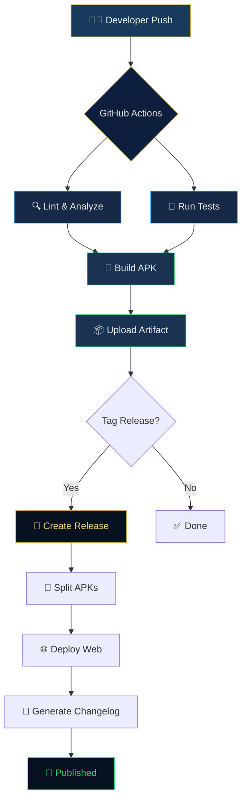
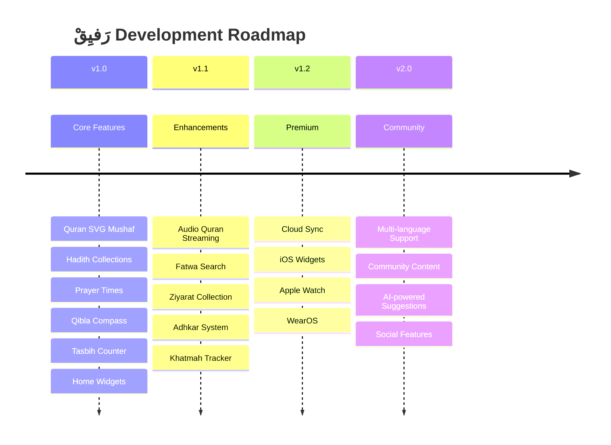

# Rafiq

A premium Islamic companion built with Flutter.

## Features
- Quran reading with SVG Mushaf and audio support
- Prayer times with reminders and notifications
- Qibla compass with live direction guidance
- Hadith, duas, adhkar, and ziyarat content
- Home screen widgets and offline-first experience

## Screenshots
Placeholder screenshots will be added here soon.

## Tech Stack
- Flutter
- Dart
- Riverpod
- Go Router
- Hive / Isar
- Firebase Hosting
- Flutter Local Notifications

## Architecture
The app follows a layered architecture with presentation, domain, data, and service layers for modularity and maintainability.

## State Management
Riverpod is used for state management, dependency injection, and reactive UI updates.

## Offline Support
Core content and user preferences are stored locally so the app remains useful without a network connection.

## Quran
The Quran experience includes SVG-based page rendering, audio playback, and rich content navigation.

## Prayer Times
Prayer calculations, notifications, and reminders are integrated for a seamless daily experience.

## Qibla
The app includes a live Qibla compass and direction-based guidance.

## Audio
Audio playback for recitation and notifications is provided through Flutter audio packages.

## Widgets
The app supports Android home screen widgets for quick access to daily content.

## Notifications
Local notifications and reminder scheduling are included for prayers and daily activities.

## Responsive Design
The UI is designed to work comfortably across phone and tablet layouts.

## Installation
1. Install Flutter SDK.
2. Clone this repository.
3. Run `flutter pub get`.
4. Run `flutter run`.

## Build Instructions
- Android: `flutter build apk --release`
- Web: `flutter build web --release`
- App bundle: `flutter build appbundle --release`

## Folder Structure
- lib/ – application source code
- assets/ – images, fonts, audio, and data
- android/ – Android platform files
- ios/ – iOS platform files
- web/ – web build files
- linux/ macos/ windows/ – desktop targets
- test/ – automated tests

## License
This project is licensed under the MIT License.

</tr>
<tr>
<td>

### 🏛️ Ziyarat
- Full Ziyarat collection
- **Sahifa Sajjadiyya**
- **Mafatih al-Jinan**
- Occasion-based browsing
- Bookmarking system
- Audio playback controls
- Reading mode toggle

</td>
<td>

### ⚖️ Fatwa
- **Arabic NLP** search engine
- Offline fatwa database
- Category filtering
- Clean architecture
- Full-text search

</td>
<td>

### 📱 Home Widgets
- **Prayer Times** (4×2 & 2×2)
- **Quran** widget (2×3)
- **Tasbih** counter (2×2)
- **Dashboard** (4×4)
- Interactive buttons
- Dark/Light themes

</td>
</tr>
</table>

</div>

---

## ⚡ Technology Stack

<div align="center">

| Layer | Technology | Purpose |
|:---:|:---:|:---|
|  | **Flutter 3.29** | UI Framework |
|  | **Dart 3.12** | Programming Language |
|  | **Riverpod 2.6** | State Management |
|  | **GoRouter 14.8** | Navigation |
|  | **Hive 2.2** | Local Database |
|  | **Kotlin 2.1** | Android Native |
|  | **Hive + SharedPrefs** | Storage |
|  | **adhan_dart** | Prayer Calculations |
|  | **home_widget** | Android Widgets |
|  | **just_audio** | Audio Playback |

</div>

---

## 📁 Project Structure

<details>
<summary><b>📂 Click to expand full project structure</b></summary>

```
daily_islamic_widget/
│
├── lib/
│   ├── main.dart                          # App entry point
│   ├── app.dart                           # MaterialApp.router root
│   │
│   ├── core/                              # Core utilities
│   │   ├── arabic_strings.dart
│   │   ├── constants.dart
│   │   ├── navigation_guard.dart
│   │   ├── api/api_client.dart
│   │   ├── cache/
│   │   │   ├── cache_manager.dart
│   │   │   └── hive_cache_manager.dart
│   │   ├── constants/
│   │   │   ├── api_constants.dart
│   │   │   └── app_constants.dart
│   │   ├── errors/
│   │   │   ├── exceptions.dart
│   │   │   └── failures.dart
│   │   ├── network/
│   │   │   ├── network_info.dart
│   │   │   └── shia_api_client.dart
│   │   └── utils/
│   │       ├── arabic_search.dart
│   │       └── hijri_date.dart
│   │
│   ├── models/                            # Data models
│   │   ├── adhkar_model.dart
│   │   ├── api_models.dart
│   │   ├── favorite_model.dart
│   │   ├── hadith_model.dart
│   │   ├── khatmah_model.dart
│   │   ├── prayer_times.dart
│   │   ├── settings_model.dart
│   │   ├── tasbeeh_model.dart
│   │   └── verse_model.dart
│   │
│   ├── providers/                         # Riverpod providers
│   │   ├── adhkar_provider.dart
│   │   ├── daily_provider.dart
│   │   ├── favorites_provider.dart
│   │   ├── khatmah_provider.dart
│   │   ├── prayer_provider.dart
│   │   ├── prayer_time_providers.dart
│   │   ├── qibla_provider.dart
│   │   ├── settings_provider.dart
│   │   ├── tasbeeh_*.dart
│   │   └── tasbih_al_zahra_provider.dart
│   │
│   ├── routes/
│   │   └── app_router.dart               # GoRouter (40+ routes)
│   │
│   ├── services/                          # Platform services
│   │   ├── adhan_scheduler.dart
│   │   ├── api_service.dart
│   │   ├── data_service.dart
│   │   ├── home_widget_service.dart       # Android home widgets
│   │   ├── location_service.dart
│   │   ├── notification_helper.dart
│   │   ├── notification_service.dart
│   │   ├── permission_service.dart
│   │   ├── prayer_notification_service.dart
│   │   ├── prayer_scheduler.dart
│   │   ├── prayer_service.dart
│   │   ├── prayer_time_service.dart
│   │   └── storage_service.dart
│   │
│   ├── theme/
│   │   ├── app_theme.dart                 # Dark + Light themes
│   │   └── ds_components.dart            # Design system
│   │
│   ├── widgets/                           # Shared widgets
│   │   ├── azkar_progress_section.dart
│   │   ├── floating_dock_nav.dart
│   │   ├── hadith_card.dart
│   │   ├── hero_illustration.dart
│   │   ├── islamic_art.dart
│   │   ├── prayer_times_cards.dart
│   │   ├── premium_navbar.dart
│   │   ├── star_background.dart
│   │   ├── tasbih_hero_card.dart
│   │   └── verse_card.dart
│   │
│   └── features/                          # 21 Feature modules
│       ├── adhkar/                        # Morning & Evening Adhkar
│       ├── bookmarks/                     # Cross-feature bookmarks
│       ├── fatwa/                         # Fatwa search (Clean Arch)
│       ├── favorites/                     # Favorites management
│       ├── hadith/                        # Sunni Hadith collections
│       ├── hadith_shia/                   # Shia Hadith (Clean Arch)
│       ├── home/                          # Main dashboard
│       ├── khatmah/                       # Quran completion tracker
│       ├── more/                          # Additional features
│       ├── onboarding/                    # First-time experience
│       ├── prayer_times/                  # Prayer times (Clean Arch)
│       ├── premium/                       # Premium feature screens
│       ├── qibla/                         # Qibla compass (Clean Arch)
│       ├── quran/                         # Quran SVG Mushaf
│       ├── quran_audio/                   # Quran audio streaming
│       ├── search/                        # Universal search
│       ├── settings/                      # App settings
│       ├── splash/                        # Animated splash screen
│       ├── tasbeeh/                       # Tasbih counter
│       ├── widget_settings/               # Widget customization
│       └── ziyarat/                       # Ziyarat & Duas (Clean Arch)
│
├── assets/
│   ├── audio/                             # Adhan audio
│   ├── decorations/                       # Islamic SVG decorations
│   ├── fonts/                             # Custom Arabic fonts
│   ├── icons/                             # App icons & SVGs
│   ├── images/                            # Background images
│   ├── data/                              # 42+ JSON data files
│   │   ├── hadiths.json
│   │   ├── verses.json
│   │   ├── aqwal/                         # Aqwal data
│   │   ├── duas/                          # Duas collection
│   │   ├── fatwa/                         # Fatwa database
│   │   ├── hadith/                        # Bukhari & Muslim
│   │   ├── imams/                         # 12 Imam quotes system
│   │   ├── mafatih/                       # Mafatih al-Jinan
│   │   ├── occasions/                     # Islamic occasions
│   │   ├── quran/                         # Quran metadata
│   │   ├── sahifa/                        # Sahifa Sajjadiyya
│   │   ├── ziyarat/                       # Ziyarat collection
│   │   └── other/                         # Adhkar, Names of Allah
│   ├── quran-svg/                         # SVG Mushaf
│   │   ├── svg/                           # 722 SVG files
│   │   └── json/                          # 724 metadata files
│   └── quran/
│       └── ImagesOfQuranPages/            # 604 JPG pages
│
├── android/
│   └── app/src/main/
│       ├── AndroidManifest.xml            # 14 permissions, 4 widgets
│       └── kotlin/.../
│           ├── MainActivity.kt
│           ├── AdhanAlarmReceiver.kt      # Exact alarm receiver
│           ├── AdhanBootReceiver.kt       # Boot persistence
│           ├── AdhanForegroundService.kt  # Adhan audio service
│           ├── AdhanPlugin.kt             # Platform channel
│           ├── DashboardWidgetProvider.kt # 4×4 widget
│           ├── PrayerTimesWidgetProvider.kt
│           ├── QuranWidgetProvider.kt
│           ├── TasbihWidgetProvider.kt
│           └── WidgetActionReceiver.kt
│
├── ios/                                   # iOS runner
├── web/                                   # Web support
├── linux/                                 # Linux desktop
├── macos/                                 # macOS desktop
└── windows/                               # Windows desktop
```

</details>

---

## 🎯 Feature Architecture

```mermaid
graph LR
    subgraph Features["21 Feature Modules"]
        direction TB
        F1["📖 Quran<br/>SVG Mushaf"]
        F2["📜 Hadith<br/>Sunni + Shia"]
        F3["🕌 Prayer Times<br/>+ Adhan"]
        F4["🧭 Qibla<br/>Compass"]
        F5["📿 Tasbih<br/>Counter"]
        F6["🤲 Adhkar<br/>M/E"]
        F7["🏛️ Ziyarat<br/>Duas"]
        F8["⚖️ Fatwa<br/>Search"]
        F9["📱 Widgets<br/>4 Types"]
        F10["🎵 Quran Audio<br/>Streaming"]
    end

    subgraph DataSources["Data Sources"]
        DS1["📱 Local JSON"]
        DS2["🌐 ShiaAPI"]
        DS3["🌐 AlAdhan API"]
        DS4["💾 Hive Cache"]
    end

    subgraph Output["User Experience"]
        UX1["🎨 Dark Theme"]
        UX2["☀️ Light Theme"]
        UX3["📱 Home Widgets"]
        UX4["🔔 Notifications"]
    end

    Features --> DataSources
    DataSources --> Output
```

<div align="center">



</div>

---

## 🎨 Design System

<div align="center">

### Color Palette

| Swatch | Name | Hex | Usage |
|:---:|:---:|:---:|:---|
| 🟫 | **Navy Deep** | `#07111F` | Primary background |
| 🔵 | **Navy Mid** | `#0D1F3C` | Card backgrounds |
| 🟦 | **Navy Light** | `#1A3A5C` | Elevated surfaces |
| 🟡 | **Gold Primary** | `#C9A84C` | Primary accent |
| 🟡 | **Gold Light** | `#F0D078` | Highlight accent |
| 🟢 | **Success** | `#2ECC71` | Success states |
| 🔵 | **Info** | `#54C5F8` | Info states |
| 🔴 | **Error** | `#E74C3C` | Error states |
| ⬜ | **Text Primary** | `#E8E8E8` | Primary text |
| 🩶 | **Text Muted** | `#8A9BB5` | Secondary text |

### Typography

| Font | Family | Usage |
|:---:|:---:|:---|
|  | `DecoTypeThuluth` | Arabic headings, decorative text |
|  | `NotoNaskhArabic` | Arabic body text, Quran verses |
|  | `Google Fonts` | UI text, Latin characters |

</div>

---

## 📱 Android Home Widgets

<div align="center">

| Widget | Size | Description |
|:---:|:---:|:---|
| 🕌 | **4×2** | **Prayer Times** — Shows next prayer, time remaining, and daily schedule |
| 📖 | **2×3** | **Quran** — Quick access to last read page with bookmark |
| 📿 | **2×2** | **Tasbih** — Interactive counter with haptic feedback |
| 📊 | **4×4** | **Dashboard** — Full widget with prayer times, Quran verse, and tasbih |

</div>

---

## 🔄 Workflow

<div align="center">



</div>

---

## 🚀 Getting Started

### Prerequisites

| Requirement | Version | Check |
|:---:|:---:|:---|
| Flutter | ≥ 3.29 | `flutter --version` |
| Dart | ≥ 3.12 | `dart --version` |
| Android SDK | API 21+ | `sdkmanager --list` |
| Java/JDK | 21+ | `java -version` |

### Installation

```bash
# Clone the repository
git clone https://github.com/Daily-Islamic-Widget/rafeeq.git
cd rafeeq

# Install dependencies
flutter pub get

# Run the app
flutter run
```

### Build Commands

<details>
<summary><b>🤖 Android</b></summary>

```bash
# Debug APK
flutter build apk --debug

# Release APK (universal)
flutter build apk --release

# Release APK (split per ABI — smaller)
flutter build apk --release --split-per-abi

# App Bundle (for Play Store)
flutter build appbundle --release
```
</details>

<details>
<summary><b>🌐 Web</b></summary>

```bash
# Build web
flutter build web --release --web-renderer canvaskit

# Serve locally
flutter run -d chrome
```
</details>

<details>
<summary><b>🖥️ Desktop</b></summary>

```bash
# Windows
flutter build windows --release

# macOS
flutter build macos --release

# Linux
flutter build linux --release
```
</details>

---

## 📊 Repository Stats

<div align="center">

<table>
<tr>
<td>


</td>
<td>


</td>
</tr>
</table>


</div>

---

## 🏆 GitHub Profile Stats

<div align="center">

<table>
<tr>
<td></td>
<td></td>
</tr>
</table>


</div>

---

## 📈 Star History

<div align="center">

[](https://star-history.com/#Daily-Islamic-Widget/rafeeq&Date)

</div>

---

## 🤖 GitHub Actions

<div align="center">

| Workflow | Status | Description |
|:---:|:---:|:---|
|  |  | Lint, test, and build APK |
|  |  | Automated release pipeline |
|  |  | Security analysis |

</div>

---

## 🛡️ Security

<div align="center">

| Metric | Status |
|:---:|:---:|
| **CodeQL Analysis** |  |
| **Dependency Review** |  |
| **Secret Scanning** |  |

</div>

---

## ⚡ Performance

<div align="center">

| Metric | Target | Status |
|:---:|:---:|:---:|
| Cold Start | < 2s | ✅ |
| Widget Load | < 1s | ✅ |
| Prayer Time Calc | < 100ms | ✅ |
| SVG Render | < 50ms | ✅ |
| Memory Usage | < 150MB | ✅ |
| APK Size | < 30MB | ✅ |

</div>

---

## 🌍 Localization

<div align="center">

| Language | Status | RTL Support |
|:---:|:---:|:---:|
| 🇸🇦 Arabic | ✅ Primary | ✅ Full RTL |
| 🇬🇧 English | ✅ Supported | ✅ LTR |

</div>

---

## 🗺️ Roadmap



---

## 📋 Changelog

<details>
<summary><b>📦 v1.0.0 — Initial Release</b></summary>

### Added
- Full SVG Mushaf with 722 pages
- 604-page JPG fallback for Quran
- Sunni Hadith collections (Bukhari, Muslim)
- Shia Hadith via ShiaAPI integration
- 12 Imam Quotes system
- Aqwal (Sayings of Ahl al-Bayt)
- Prayer time calculation with Adhan audio
- Qibla compass with real-time animation
- Tasbih counter with multiple dhikr types
- Tasbih al-Zahra
- Morning & Evening Adhkar
- Ziyarat collection
- Sahifa Sajjadiyya
- Mafatih al-Jinan
- Fatwa search with Arabic NLP
- 4 Android home screen widgets
- Quran audio streaming
- Khatmah (completion) tracker
- Bookmark system
- Search functionality
- Settings with theme support
- Dark mode with luxury navy + gold theme
- Light mode support
- Arabic RTL support
- English locale support
- Onboarding flow
- Animated splash screen
- Custom Arabic fonts (DecoType Thuluth, Noto Naskh Arabic)
- Boot receiver for prayer time persistence
- Foreground service for Adhan audio
- Permission handling system
- Hive-based caching
- GoRouter with 40+ routes
- Riverpod state management
- Feature-first clean architecture

</details>

---

## 🤝 Contributing

<div align="center">

**We welcome contributions!**

Please read our [Contributing Guidelines](CONTRIBUTING.md) before submitting a PR.

[](https://github.com/Daily-Islamic-Widget/rafeeq/graphs/contributors)

</div>

---

## ❓ FAQ

<details>
<summary><b>Is this app free?</b></summary>

**Yes.** Rafeeq is completely free and open-source under the MIT License.

</details>

<details>
<summary><b>Does it work offline?</b></summary>

**Yes.** Quran pages, Hadith collections, Adhkar, Duas, Ziyarat, and more are bundled as local JSON data. Prayer times are calculated locally. Only audio streaming and ShiaAPI features require internet.

</details>

<details>
<summary><b>What Android versions are supported?</b></summary>

**Android 5.0 (API 21) and above.** This covers 99%+ of active Android devices.

</details>

<details>
<summary><b>How accurate are prayer times?</b></summary>

Prayer times use the `adhan_dart` library which supports multiple calculation methods (MWL, ISNA, Egypt, Makkah, Karachi, Tehran, etc.) with GPS-based location accuracy.

</details>

<details>
<summary><b>Can I contribute Hadith translations?</b></summary>

Yes! Check our [Contributing Guide](CONTRIBUTING.md) for details on adding content.

</details>

<details>
<summary><b>Why is the app called Rafeeq?</b></summary>

رَفيِقْ (Rafeeq) means "companion" in Arabic — a faithful friend who walks with you on your spiritual journey.

</details>

---

## ⚠️ Known Limitations

| Issue | Status | Workaround |
|:---|:---:|:---|
| iOS home widgets not yet implemented | 🔄 Planned | Use Android or in-app widgets |
| Audio requires internet for streaming | ℹ️ By design | Quran pages work fully offline |
| Web build uses CanvasKit (larger) | 🔄 Optimizing | Use auto renderer for smaller bundle |
| Desktop support is experimental | 🔄 In progress | Mobile is the primary target |

---

## 📄 License

<div align="center">

This project is licensed under the **MIT License** — see the [LICENSE](LICENSE) file for details.

[](https://opensource.org/licenses/MIT)

</div>

---

## 🙏 Acknowledgements

<div align="center">

- [Flutter](https://flutter.dev) — Beautiful native apps in record time
- [Riverpod](https://riverpod.dev) — Robust state management
- [Hive](https://hive.io) — Fast, lightweight local database
- [adhan_dart](https://pub.dev/packages/adhan_dart) — Prayer time calculations
- [ShiaAPI](https://shiaapi.com) — Shia hadith data
- [AlAdhan API](https://aladhan.com/prayer-times-api) — Prayer time API
- [Noto Naskh Arabic](https://fonts.google.com/noto/specimen/Noto+Naskh+Arabic) — Arabic typeface
- [DecoType Thuluth](https://www.decotype.com) — Decorative Arabic font
- Every contributor and user who makes this project better
- **جزاكم الله خيراً** — May Allah reward you all

</div>

---

## ☕ Support the Project

<div align="center">

If Rafeeq has been beneficial to you, consider supporting its development:

[](https://buymeacoffee.com/)
[](https://github.com/sponsors/Daily-Islamic-Widget)

Your support helps maintain and improve this Islamic companion app.

</div>

---

## 👨‍💻 Author

<div align="center">


---

**Built with ❤️ and Flutter for the Ummah**

<div align="center">


</div>

---

<div align="center">

**بِسْمِ اللهِ الرَّحْمٰنِ الرَّحِيْمِ**

---

*May this app be a means of closeness to Allah SWT*

**رَفيِقْ** — *Your Premium Islamic Companion*

</div>

</div>

---

<div align="center">

<a href="https://github.com/Daily-Islamic-Widget/rafeeq">

</a>

**[⬆ Back to Top](#-رفيق--rafeeq)**

</div>
